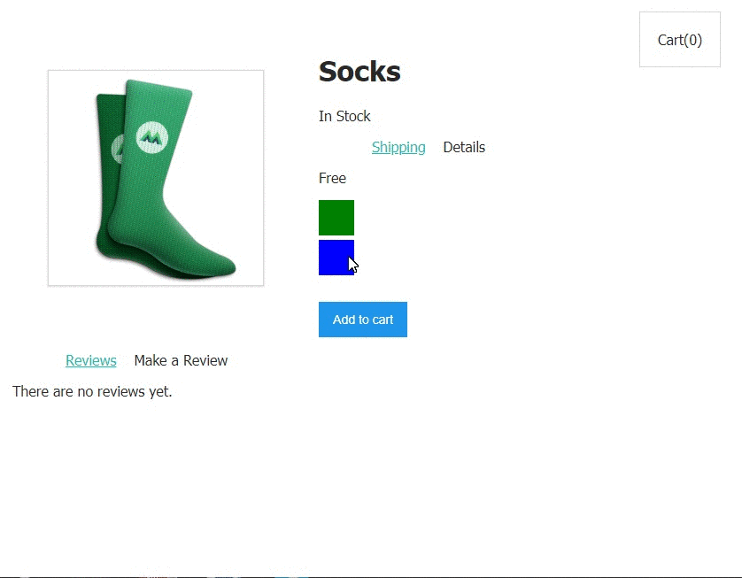

# vue-shopping-cart

A sample shopping cart application created with VueJS. Concepts learnt:
- VueJS basic
- Attribute binding and Vue directives
- Data, Computed data, Props, Class & Style
- Event handling and communicating events
- Vue resuable components
- Forms and two-way binding

## Resource used
https://www.vuemastery.com/courses/intro-to-vue-js/vue-instance

## App Demo

